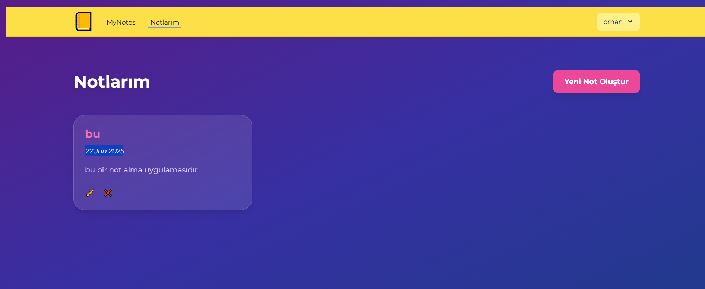
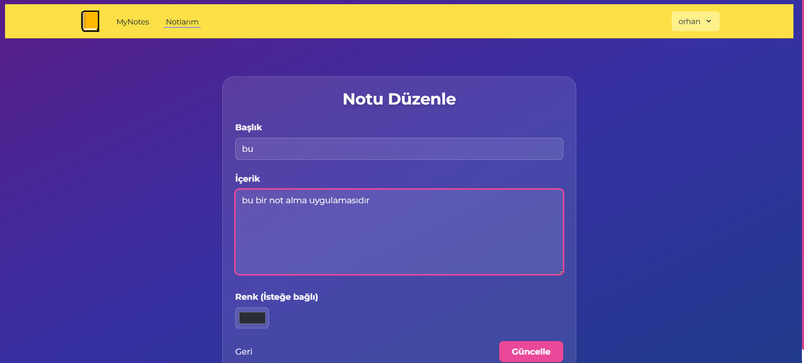

# 📝 MyNotes - Laravel Not Uygulaması

**MyNotes**, kullanıcıların kendi notlarını güvenli bir şekilde oluşturup yönetebildiği sade ve şık bir Laravel tabanlı not uygulamasıdır.

## 🚀 Özellikler

- ✅ Kullanıcı kaydı ve giriş
- ✅ E-posta güncelleme, doğrulama
- ✅ Şifre güncelleme
- ✅ Not oluşturma, listeleme, düzenleme ve silme (CRUD)
- ✅ Kullanıcı profili görüntüleme ve düzenleme
- ✅ Renk seçimi ile notlara kategori/önem belirleme


## 🛠️ Kullanılan Teknolojiler

- Laravel 10.x
- Laravel Breeze
- Tailwind CSS
- SQLite 
- PHP 8.x

## 📷 Ekran Görüntüleri

Projede kullanılan bazı ekran görüntüleri:






*Not:* Görseller `screenshots/` klasöründe bulunur.

## 🎨 Tasarım Kaynağı

Bu projede kullanılan arayüz bileşenleri ve stil yapısı, [TailwindFlex.com](https://tailwindflex.com) sitesinden alınan bir tasarım şablonundan ilham alınarak geliştirilmiştir. Renkler, kart yapısı, bulanıklık efekti (backdrop blur) ve genel stil yapısı projeye entegre edilerek özelleştirilmiştir.

Tasarımın orijinal kaynağına saygı duyularak sadece frontend görsel düzenlemelerde kullanılmıştır.

## Testler

Projede Laravel’in varsayılan test yapısı kullanılmıştır.  
Tüm testler başarıyla geçmektedir ve aşağıda test sonuçları özetlenmiştir:

- Authentication (giriş) testleri  
- Email verification (email doğrulama) testleri  
- Password reset (şifre sıfırlama) testleri  
- Profile (profil) testleri  
- Diğer fonksiyonel ve birim testler  

Testleri çalıştırmak için terminalde şu komutu kullanabilirsiniz:

```bash
php artisan test


## 📦 Kurulum

Projeyi yerel makinenizde çalıştırmak için şu adımları izleyin:

```bash
git clone https://github.com/kullanici-adiniz/mynotes.git
cd mynotes

composer install
npm install && npm run build

cp .env.example .env
php artisan key:generate

php artisan migrate

php artisan serve


